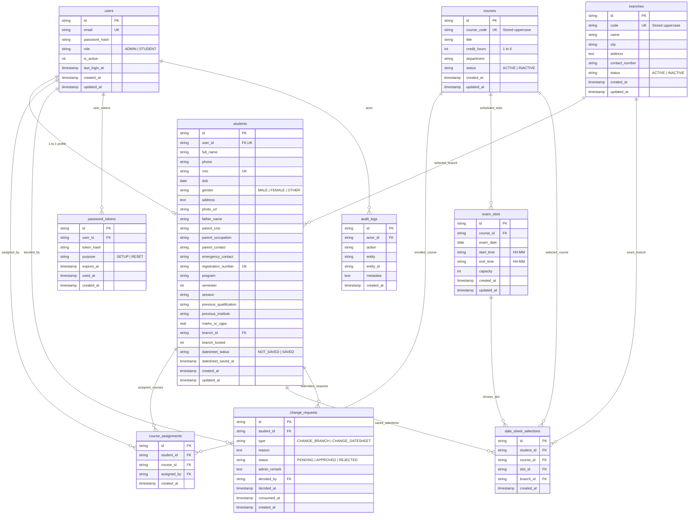

# ExamSlot — Entity-Relationship Diagram (ERD)

This document describes the complete relational database model for **ExamSlot**.

---

## 1. Mermaid ERD Diagram

---

## 2. Entity Descriptions & Key Constraints

| Entity | Purpose | Key Constraints |
|---|---|---|
| **users** | System credentials and roles | `email` UNIQUE, `role` IN ('ADMIN', 'STUDENT') |
| **branches** | Exam campuses across cities | `code` UNIQUE (uppercase), `status` IN ('ACTIVE', 'INACTIVE') |
| **courses** | Offered academic courses | `course_code` UNIQUE (uppercase), `credit_hours` between 1 and 6 |
| **students** | Complete 3-group student profile | `user_id` UNIQUE, `registration_number` UNIQUE, `cnic` UNIQUE |
| **course_assignments** | Assigned courses mapping (4–6 per student) | UNIQUE(`student_id`, `course_id`) |
| **exam_slots** | Exam date and time schedules | UNIQUE(`course_id`, `exam_date`, `start_time`) |
| **date_sheet_selections** | Finalized date sheet selections | UNIQUE(`student_id`, `course_id`) |
| **change_requests** | Branch/Date sheet change requests | Partial UNIQUE(`student_id`, `type`) WHERE status = 'PENDING' |
| **password_tokens** | 24-hour single-use setup/reset links | `purpose` IN ('SETUP', 'RESET'), `token_hash` indexed |
| **audit_logs** | Admin action audit logging | FK to `users.id` (ON DELETE SET NULL) |
